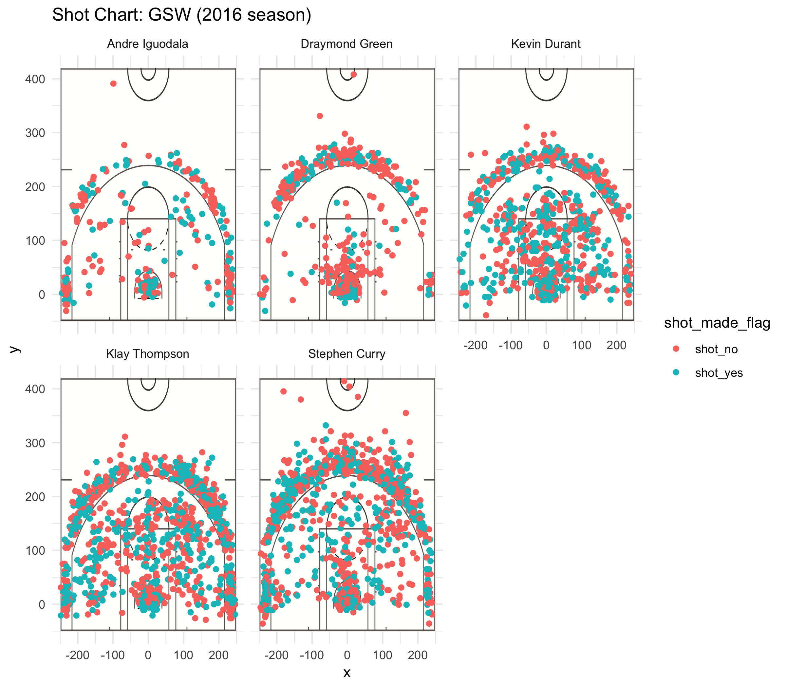

```{r out.width = '80%', echo = FALSE, fig.align = 'center'}
knitr::include_graphics('../images/gsw-shot-charts')

```


```{r}
# 5.1) Effective Shooting Percentage
shots_data <- read.csv(file="../data/shots-data.csv")

# Table 1: 2PT Effective Shooting % by Player
effective_shooting_2pt <- arrange(summarise(group_by(filter(shots_data, shot_type == "2PT Field Goal"), name), total = n(), made = sum(shot_made_flag == "shot_yes"), percentage = made / total), desc(percentage))
effective_shooting_2pt

# Table 2: 3PT Effective Shooting % by Player
effective_shooting_3pt <- arrange(summarise(group_by(filter(shots_data, shot_type == "3PT Field Goal"), name), total = n(), made = sum(shot_made_flag == "shot_yes"), percentage = made / total), desc(percentage))
effective_shooting_3pt

# Table 3: Effective Shooting % by Player
effective_shooting <- arrange(summarise(group_by(shots_data, name), total = n(), made = sum(shot_made_flag == "shot_yes"), percentage = made / total), desc(percentage))
effective_shooting
```

# 5.2) Narrative

#**HOW EFFICIENT ARE GSW BIG FIVE IN 2016 GOLDEN SEASON?**

##Supreme Shooting Efficiency of BIG FIVE leads Golden State Warrior a Golden 2016 Season.

```{r out.width = '80%', echo = FALSE, fig.align = 'center'}
knitr::include_graphics('/Desktop/GSW BIG FIVE.jpg')
```

###With the acquisition of free agent Kevin Durant in the offseason, GSW formed a new All-Star "Fantastic Four" of Kevin Durant, Stephen Curry, Klay Thompson, Draymond Green. What’s more, with Andre Iguodala, the best sixth man, the GSW were hailed as a “Superteam” and won their 5th NBA Championship, setting the best postseason record in NBA history by going 16 - 1. (Reference: Wikipedia)

###As the best team in this 2016-2017 season, what leads to their success? Great coach? Constructive Tactics? The top stars? By digging into this golden team, although they have great coaches and excellent tactics, the most significant part of winning based on the players themselves. Through the 2016-2017 NBA Champion, Warriors had swept all the opposing teams with their terrifying and record-breaking field goal efficiency. With breaking a number of records because of their high shooting efficiency, such as ‘First team to have four players hit four three-pointers in a single game’; ‘Most points in a playoff game, first quarter’; ‘Most three-pointers in an NBA Finals half’. 


```{r out.width='80%', echo=FALSE, fig.align='center'}

```
##The graph above shows the shooting efficiency at different spots on the court, in which blue represents shots went in, and red represents shots missed. It is apparent to see that Kevin Durant, Klay Thompson and Stephen Curry have much more blue points than red points. That is, a supreme shooting effciency. However, it might be more clear to see the table below.

```{r}
effective_shooting
```

##The table above shows the overall effective shooting percentage by Players(including 2PT and 3PT Field Goalds). With an average around 45% of the overall effective shooting percentage, 4 out of BIG FIVE in Warriors are higher than the average. Especially Kevin Durant, who has a 54% of overall shooting efficiency, which is almost 10% higher than the average.

```{r}
effective_shooting_2pt
```

##What's more, this table shows a 2 PT Field Goal effective shooting percentage by players, leading by 64% by Andre Iguodala and 61% by Kevin Durant. With an average around 55% of the 2PT Field Goal effective shooting percentage, again, 4 out of BIG FIVE in Warriors are higher than the average.

```{r}
effective_shooting_3pt
```

##Same as the above, this table shows a 3 PT Field Goal effective shooting percentage by players. With an average around 35% of the 3PT Field Goal effective shooting percentage,4 players out of BIG FIVE in Warriors are higher than the average.

##The stats data apparently shows that this All-Star team has a terrifying shooting efficiency in both 2-points field and 3-points field, in which most of the players have a higher shooting efficiency than the average of the whole NBA teams. 

##Within this golden team, the 2 most well-known players are Kevin Durant and Stephen Curry.

```{r out.width='80%', echo=FALSE, fig.align='center'}
knitr::include_graphics('Desktop/Kevin Durant.jpg')
```

####Kevin Durant has made 915 shots, and 495 of them went in, with an effective shooting percentage of 54%, and was the leading effective shooting player in Golden State Warriors. Kevin Durant did a great job in 2-points Field, ranked no.2 within the team, but much higher than the average of the whole NBA. In terms of 3-points field, Kevin has a shooting efficiency of 39%, ranked no.3 within the team, but still 4% higher than the average.

```{r out.width='80%', echo=FALSE, fig.align='center'}
knitr::include_graphics('Desktop/Stephen Curry.jpg')
```

####Stephen Curry has made 1250 shots, and 584 of them successully went into the baskets, with an effective shooting percentage of 46.7%, and ranked no.3 of effective shooting player in Golden State Warriors. In terms of 2-points field, Kevin has a shooting efficiency of 54%, similar to the average of NBA, ranked no.3 within the team. Curry did a great job in 3-points Field, ranked no.2 within the team, but much higher than the average of the whole NBA. 

##To summarise, the Golden State Warriors did a perfect job in 2016-2017 season, leading to the championship. There shooting efficiency is definitely the best throughout the NBA teams in this season. In conclusion, Supreme Shooting Efficiency of BIG FIVE leads Golden State Warrior a Golden 2016 Season.

