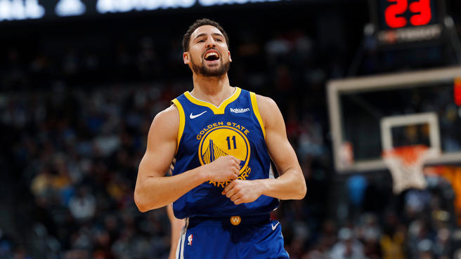
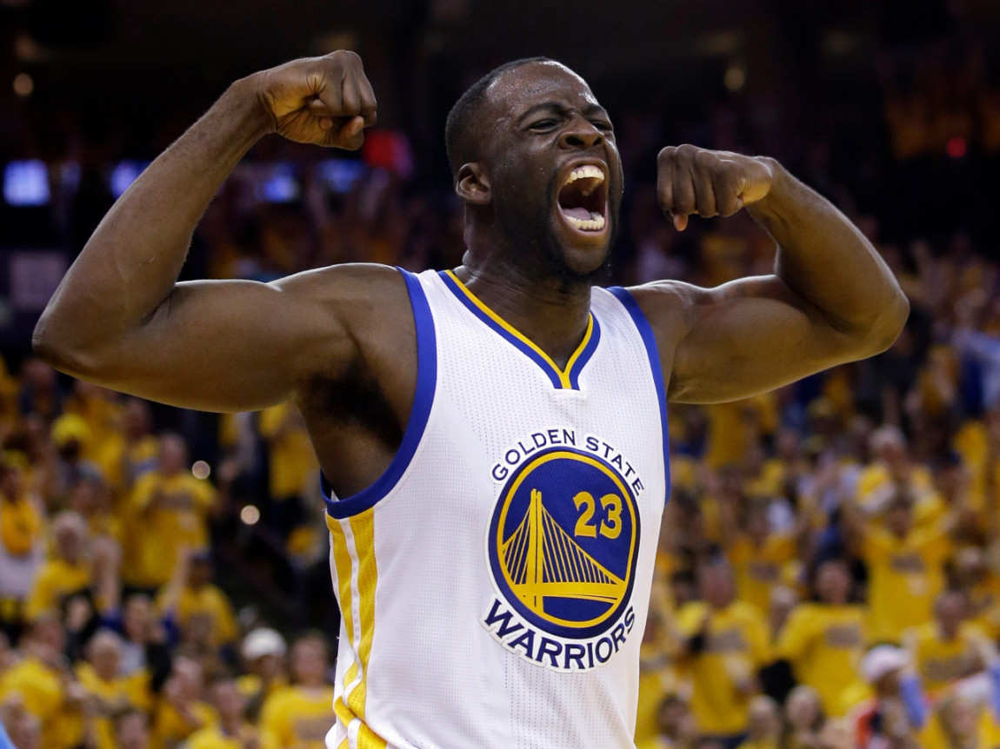

```{r}
library(dplyr)
# 5.1) Effective Shooting Percentage
shots_data <- read.csv(file="../data/shots-data.csv")

# Table 1: 2PT Effective Shooting % by Player
effective_shooting_2pt <- arrange(summarise(group_by(filter(shots_data, shot_type == "2PT Field Goal"), name), total = n(), made = sum(shot_made_flag == "shot_yes"), percentage = made / total), desc(percentage))
effective_shooting_2pt

# Table 2: 3PT Effective Shooting % by Player
effective_shooting_3pt <- arrange(summarise(group_by(filter(shots_data, shot_type == "3PT Field Goal"), name), total = n(), made = sum(shot_made_flag == "shot_yes"), percentage = made / total), desc(percentage))
effective_shooting_3pt

# Table 3: Effective Shooting % by Player
effective_shooting <- arrange(summarise(group_by(shots_data, name), total = n(), made = sum(shot_made_flag == "shot_yes"), percentage = made / total), desc(percentage))
effective_shooting
```

# 5.2) Narrative

#**HOW EFFICIENT ARE GSW BIG FIVE IN 2016 GOLDEN SEASON?**

##Supreme Shooting Efficiency of BIG FIVE leads Golden State Warrior a Golden 2016 Season.

```{r out.width = '80%', echo = FALSE, fig.align = 'center'}

```

###With the acquisition of free agent Kevin Durant in the offseason, GSW formed a new All-Star "Fantastic Four" of Kevin Durant, Stephen Curry, Klay Thompson, Draymond Green. What’s more, with Andre Iguodala, the best sixth man, the GSW were hailed as a “Superteam” and won their 5th NBA Championship, setting the best postseason record in NBA history by going 16 - 1. (Reference: Wikipedia)

###As the best team in this 2016-2017 season, what leads to their success? Great coach? Constructive Tactics? The top stars? By digging into this golden team, although they have great coaches and excellent tactics, the most significant part of winning based on the players themselves. Through the 2016-2017 NBA Champion, Warriors had swept all the opposing teams with their terrifying and record-breaking field goal efficiency. With breaking a number of records because of their high shooting efficiency, such as ‘First team to have four players hit four three-pointers in a single game’; ‘Most points in a playoff game, first quarter’; ‘Most three-pointers in an NBA Finals half’. 


```{r out.width='80%', echo=FALSE, fig.align='center'}
knitr::include_graphics('../images/gsw-shot-charts.png')
```

###The graph above shows the shooting efficiency at different spots on the court, in which blue represents shots went in, and red represents shots missed. It is apparent to see that Kevin Durant, Klay Thompson and Stephen Curry have much more blue points than red points. That is, a supreme shooting effciency. However, it might be more clear to see the table below.


```{r, echo = FALSE}
effective_shooting
```

###The table above shows the overall effective shooting percentage by Players(including 2PT and 3PT Field Goalds). With an average around 45% of the overall effective shooting percentage, 4 out of BIG FIVE in Warriors are higher than the average. Especially Kevin Durant, who has a 54% of overall shooting efficiency, which is almost 10% higher than the average.


```{r, echo = FALSE}
effective_shooting_2pt
```

###What's more, this table shows a 2 PT Field Goal effective shooting percentage by players, leading by 64% by Andre Iguodala and 61% by Kevin Durant. With an average around 55% of the 2PT Field Goal effective shooting percentage, again, 4 out of BIG FIVE in Warriors are higher than the average.


```{r, echo = FALSE}
effective_shooting_3pt
```

###Same as the above, this table shows a 3 PT Field Goal effective shooting percentage by players. With an average around 35% of the 3PT Field Goal effective shooting percentage,4 players out of BIG FIVE in Warriors are higher than the average.

###The stats data apparently shows that this All-Star team has a terrifying shooting efficiency in both 2-points field and 3-points field, in which most of the players have a higher shooting efficiency than the average of the whole NBA teams. 


##**Kevin Durant**
```{r out.width='80%', echo=FALSE, fig.align='center'}

```

###Kevin Durant, small forwards, leading player in GSW. From the shot chart, we found that Durant prefers shooting within three-point line, with a higher accuracy of 61% when shooting at a 2-PT Field. However, Durant’s shooting efficiency on three-point line is not as strong as his on two-point line, ranked No.3 within the team around 39%. Nonetheless, this doesn’t affect him being the one has the highest overall shooting efficiency of 54% in Warriors. This helps Kevin Durant won the NBA Finals MVP award in 2016 season, the third time a Warrior has won it. 


##**Stephen Curry**
```{r out.width='80%', echo=FALSE, fig.align='center'}

```

###As the most popular 3-point Shooter, Stephen Curry has unsurprisingly highest 3-PT Field shots in this season within the team, and the second highest 3-PT Field shooting efficiency at 41%. From the Shot Chart, it is clear that Curry has far more shots on three-point line than two-point line and is more accurate when he is 45-degree right to the basket.

###However, it was a shock to see that Curry ranked No.3 in the 2PT-Field and 4th in the overall shooting efficiency. That’s probably because a lot of opposing teams increased defence when they against Curry, disputing him to shoot from his comfortable zone, that is, his accuracy in 2PT Field is low, so as the overall efficiency.


##**Klay Thompson**
```{r out.width='80%', echo=FALSE, fig.align='center'}

```

###Klay Alexander Thompson, shooting guard of GSW, is credited as one of the greatest shooters in NBA history. It is not hard to see that Thompson is a great shooter from the table, Thompson has the highest 3-PT Field shooting efficiency of 42%, which is about 7% higher than the NBA average. However, he ranked No.4 in terms of 2PT-Field, in which he had almost same number of shots as Durant, but a 9% lower shooting efficiency. From the Shot Chart, we can see that Klay has a high accuracy outside of the three-point line and he especially prefers to shoot on the left side of the court. 

##**Andre Iguodala**
```{r out.width='80%', echo=FALSE, fig.align='center'}
knitr::include_graphics('../images/Andre Iguodala.jpg')
```

###The best sixth man in GSW, Andre Iguodala is a shooting guard. Iguodala helped the Warriors start the 2016 season 16-2 while recording their 12th straight victory through his season-best game with 12 points, five rebounds and five assists.

###From the Shot Chart, we found that his shot positions are evenly distributed between the two-point line and three-point line, however, the total number of shots Iguodala made are far fewer than other players because he stays more time on bench than on court comparing with other 4 players. Nonetheless, from the shooting efficiency table, Iguodala ranked No.1 in the 2PT Field and No.2 in the overall shooting efficiency within the team. This shows that although he’s not on court very often, his high shooting efficiency proves himself as the best sixth man in Warrior. 


##**Draymon Green**
```{r out.width='80%', echo=FALSE, fig.align='center'}

```

###Draymond Green, plays primarily at the power forward position, is a three-time NBA champion and a three-time NBA All-Star. Due to Green’s position, he has the lowest shooting efficiency in both 2PT Field and 3PT Field within the team as shown on the above table. According to the shot chart, we found that Green prefers to shoot on 2-point line and has a higher shooting efficiency with 49% there. Because of his fair 2-PT shooting efficiency and strong defence ability, Green won the Defensive Player of the Year Award at the NBA Awards, the first time a Warrior has won it.

###To summarise, the Golden State Warriors did a perfect job in 2016-2017 season, leading to the championship and also Team of the Year Award at the Espy Awards. There shooting efficiency is definitely the best throughout the NBA teams in this season. Golden State Warriors dominate 2016 Season and name it as a Golden Season. The dominance will continue as long as they have this Golden Team. 

